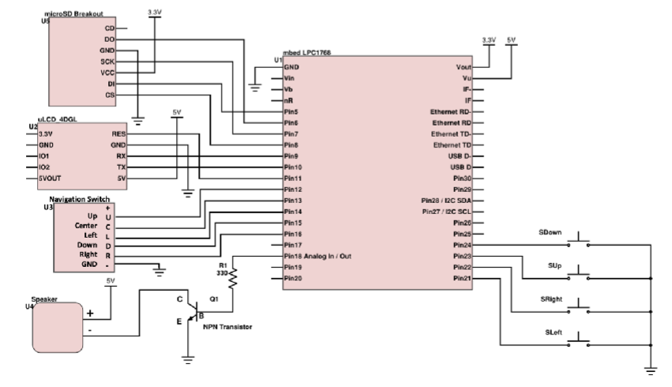

# BUZZ COMBAT: Hive Deffense

A fast-paced retro shooter built on the ARM mbed platform.  
Defend your hive from continuous waves of enemies using movement and missile attacks.

Developed for **ECE 2035 – Programming Hardware/Software Systems**  
**Georgia Institute of Technology**  
Solo Project — *Nazanin Rajabi*

---

## Game Objective

Survive enemy attacks and score points to protect the hive.

| Action | Result |
|--------|--------|
| Hit an enemy | Score increases |
| Player gets hit | Strikes decrease |
| Score reaches 50 | Player Wins |
| Strikes reach 0 | Game Over |

---

## Controls

| Input | Action |
|-------|--------|
| Nav Switch: Up / Down / Left / Right | Move the player |
| Fire Button | Shoot a missile |
| Start Button | Start / Pause / Resume game |

---

## Features

- Random enemy generation  
- Projectile/enemy collision detection  
- Player strike/health system  
- Scoring + multiplier logic  
- Pause screen  
- Win/Lose screens  
- Linked-list based tracking of enemies and projectiles  
- Real-time updates using timers

---

## Hardware Architecture

System uses:

- mbed LPC1768 microcontroller
- 4DGL uLCD display
- Navigation Switch
- NPN-driven speaker output
- Optional microSD module

**Hardware Block Diagram:**



---

## Build Instructions

Clone and compile using Mbed CLI:

```bash
git clone https://github.com/Nazanin-Rajab/ECE-2035---Buzz-Combat-Project-2-.git
cd ECE-2035---Buzz-Combat-Project-2-
mbed compile -m LPC1768 -t GCC_ARM --flash --sterm
